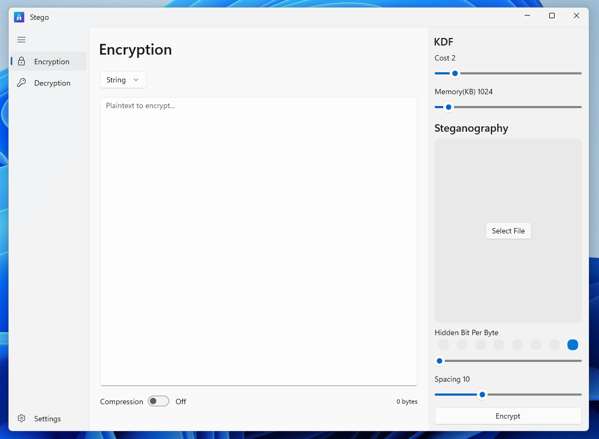

<h1 align="center">
   
  Stego UI
</h1>

> A simple steganography UI tool build with WinUI 3 to hide data in images using LSB (Least Significant Bit) technique.

## ⭐ Features
- Hide data in images using LSB technique
- Extract hidden data from images
- Supports lossless image formats (PNG, BMP)
- User-friendly interface
- Encryption/Decryption without steganography should user want to use it
- Argon2id password hashing for security
- System theme support (light/dark mode)

## Requirements
- .NET 8.0 or later
- Windows 10 or later

## Installation
> Not yet available, but you can build the project from source.

